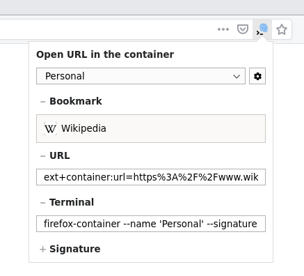

# Open external links in a container


_**Important:** this code corresponds to an early preview of the future 2.x.x branch. If you want to access the current stable code, please see [version 1.0.3](https://github.com/honsiorovskyi/open-url-in-container/tree/1.0.3)._

This is a Firefox extension that enables support for opening links in specific containers using custom protocol handler.
It works for terminal, OS shortcuts, bookmarks, password managers, regular HTML pages and many other things.

Also it features a small popup that can be called from the icon in the address bar
which provides a way to get the links or terminal commands for opening current page
in any available container.

This extension can be installed from the [official Mozilla Add-Ons Store for Firefox](https://addons.mozilla.org/firefox/addon/open-url-in-container/).



## Features

- provides custom protocol handler to open URLs in containers
- provides a UI to generate links, bookmarks and terminal commands
- supports both command line and internal invocations
- supports creation of containers on the fly
- supports setting colors and icons when creating new containers
- supports tabs pinning
- supports opening tabs in reader mode
- works well in combination with other extensions

## Examples

Open `https://mozilla.org` in a container named `MyContainer`.

```bash
$ firefox 'ext+container:name=MyContainer&url=https://mozilla.org&signature=ea7214f675398e93764ba44504070221633b0d5dce6c4263715f1cca89ab5f86'
```

Open `https://mozilla.org` in a container named `MyContainer`. If the container doesn't exist, create it using an `orange` colored `fruit` icon. Also, pin the tab.

```bash
$ firefox 'ext+container:name=MyContainer&color=orange&icon=fruit&url=https://mozilla.org&pinned=true&signature=ea7214f675398e93764ba44504070221633b0d5dce6c4263715f1cca89ab5f86'
```

Also it will work with the [links on the site](ext+container:name=MyContainer&url=https://mozilla.org):

```html
<a href="ext+container:name=MyContainer&url=https://mozilla.org&signature=ea7214f675398e93764ba44504070221633b0d5dce6c4263715f1cca89ab5f86">Mozilla.Org in MyContainer</a>
```

### What is signature?

Signature is very simple cryptographic signature of the URL passed to the extension.

It is needed to protect you from situations when someone with malicious intentions,
knowing that for instance you have a container named `Personal` with your private information,
could somehow force you to click on a link that looks like `ext+container:name=Personal&url=https://evil.com/correlationID=XXX`,
and therefore, thanks to `XXX` passed to `evil.com` in the `Personal` container, and the same `XXX` passed to the same `evil.com`
but openly in a public container, track your identity across the containers.

To prevent it from happening, this extension will do the following:

1. If it receives a link without signature (e.g. `ext+container:name=Personal&url=https://evil.com/correlationID=XXX`),
it will **ask you** if you really want to open this link, therefore making you aware that someone might be trying to track you,
and also providing a possibility to prevent this (by not opening the link).

2. If it recieved a link with a signature (e.g. `ext+container:name=Personal&url=https://good.com/&signature=2f7154ebeb22dd3136213aef6e385eabf63aa2d42cabc5d61beff9d52c4c5daa`).
it will check that this URL is signed by a key that is known **only to you and your local copy of this extension**.
therefore guaranteeing that this request is legit, sanctioned by you and can be opened automatically.

It is obvious that this extra step creates certain friction when using the extension, so that's why a couple of features
to mitigate the inconvenince have been added:

1. The extension now comes with a small popup that would provide you with an easy way to create secure links or terminal commands for any page you need to be opened in any container.

2. The signing mechanism uses a simple and well-known yet pretty secure HMAC-SHA256 algorithm, and the signing key is avalable in the extension UI (please be careful with it!),
therefore enabling you to easily integrate signature generation in your scripts or applications.

3. The launcher included with the extension already has a built-in support for URL signing, therefore you can pass the signing key using environment variables,
and keep using the launcher without having to deal with signatures at all (again, please be careful with the signing key!).

## Launcher

Shell launcher provides a shortcut for opening links in a more user-friendly and unix-style way.

```
$ firefox-container --help
firefox-container - open URL in a specific container in Firefox.

Usage:
        firefox-container [OPTIONS] URL
        firefox-container URL [OPTIONS]
        firefox-container -h|--help

Where optional OPTIONS may include any combination of:
        --COLOR                 color for the container (if does not exist)
        --ICON                  icon for the container (if does not exist)
  -n,   --name=NAME             container name (default: domain part of the URL)
  -s,   --signature=SIGNATURE   container signature to prevent clickjacking; also see (1) below
  -p,   --pin                   pin tab
  -r,   --reader                open tab in the reader mode

Where COLOR is one of:
        --blue
        --turquoise
        --green
        --yellow
        --orange
        --red
        --pink
        --purple

Where ICON is one of:
        --fingerprint
        --briefcase
        --dollar
        --cart
        --circle
        --gift
        --vacation
        --food
        --fruit
        --pet
        --tree
        --chill

Environment variables:
  (1)   OPEN_URL_IN_CONTAINER_SIGNING_KEY       signing key for the clickjacking prevention mechanism; if set to a non-empty value, SIGNATURE will be generated by automatically
```

### Installation example

```bash
$ curl -sL https://github.com/honsiorovskyi/open-url-in-container/raw/master/launcher.sh | sudo tee /usr/bin/firefox-container > /dev/null
$ sudo chmod 0755 /usr/bin/firefox-container
```

## Build

### Step 1: Install node, npm, yarn
### Step 2:
```bash
$ git clone https://github.com/honsiorovskyi/open-url-in-container.git

$ cd open-url-in-container/build

$ yarn

$ yarn build
```

## License

[Mozilla Public License Version 2.0](LICENSE)

## Contibutions

Contibutions are very welcome. There's no specific process right now, just open your PRs/issues in this repo.
